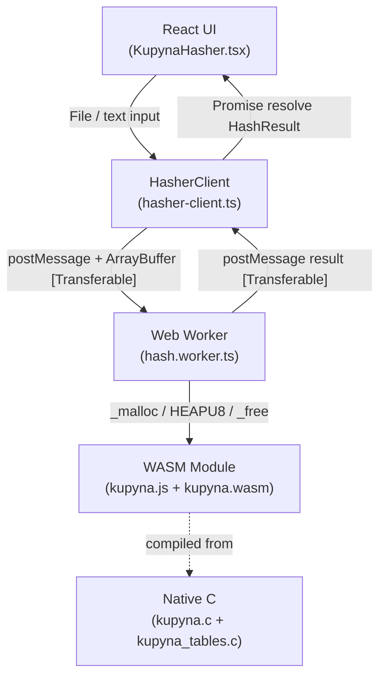
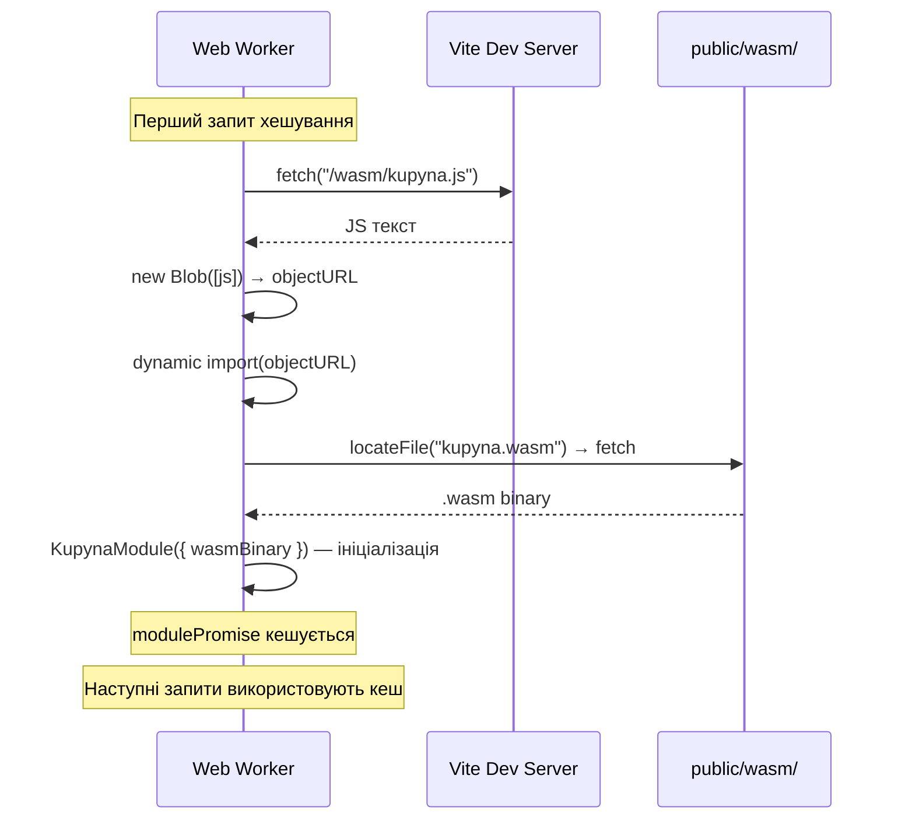
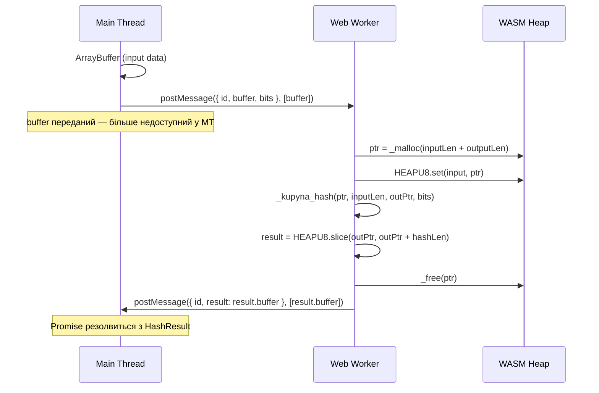

# Купина (ДСТУ 7564:2014) — WebAssembly реалізація

> [English version](README.md)

[](https://github.com/justpetrovych/dstu7564-ts-worker/actions/workflows/deploy.yml)
[](LICENSE)

> **Увага:** Це навчально-дослідницький проект для вивчення інтеграції WebAssembly з Web Workers у браузері. **Не призначений для production-використання.** Для реальних криптографічних задач використовуйте перевірені бібліотеки та нативні браузерні API (SubtleCrypto).

Реалізація українського криптографічного стандарту **Купина (ДСТУ 7564:2014)** на WebAssembly з SIMD оптимізаціями, Web Worker та React 19 демо-сторінкою.

**[→ Демо на GitHub Pages](https://justpetrovych.github.io/dstu7564-ts-worker/)**

## Мета проєкту

Цей репозиторій є практичним дослідженням того, **як правильно інтегрувати WASM у Web Worker**:

- Як завантажити Emscripten-модуль у Worker, обходячи бандлер (Vite)
- Як передавати дані між Main Thread і Worker через **Transferable Objects** (нульове копіювання)
- Як кешувати WASM-модуль між запитами в межах одного Worker-процесу
- Як організувати Promise-based API поверх `postMessage`-комунікації
- Як правильно налаштувати COOP/COEP заголовки для `SharedArrayBuffer`

## Особливості

- **WebAssembly SIMD** — C-реалізація скомпільована через Emscripten з `-O3 -msimd128`
- **Web Worker** — обчислення в окремому потоці, UI не блокується
- **Transferable Objects** — нульове копіювання `ArrayBuffer` між потоками
- **Повна відповідність ДСТУ 7564:2014** — верифіковані криптографічні константи
- **Vitest тести** — unit тести для утиліт + криптографічна коректність проти еталонних значень

## Підтримувані розміри хешу

| Алгоритм    | Виведення  | Блок      | Раунди |
|-------------|------------|-----------|--------|
| Купина-256  | 32 байти   | 512 біт   | 10     |
| Купина-384  | 48 байтів  | 1024 біт  | 14     |
| Купина-512  | 64 байти   | 1024 біт  | 14     |

## Архітектура

### Загальна схема потоків



### Завантаження WASM у Worker



### Передача даних між потоками



## Ключові архітектурні рішення

### Чому Blob URL для завантаження WASM

Vite трансформує всі `import()` при збірці. Emscripten генерує власний `import()` для завантаження `.wasm` файлу, тому прямий `import('kupyna.js')` ламається після бандлінгу. Рішення — завантажити JS як текст через `fetch`, загорнути у Blob URL, і вже його передати в `import()`. Так Vite не чіпає Emscripten-модуль.

### Чому Transferable, а не копія

Для великих файлів (десятки MB) копіювання `ArrayBuffer` між потоками коштувало б суттєвого часу та пам'яті. `Transferable` передає **власність** буфера без копіювання — O(1) операція незалежно від розміру.

### Чому один Worker, а не Worker Pool

Для демо-сценарію (один файл за раз) один Worker достатній. Модуль WASM ініціалізується один раз і кешується. Для паралельної обробки кількох файлів варто розглянути `WorkerPool` або `SharedArrayBuffer` + `Atomics`.

## Структура проєкту

```
dstu7564-ts-worker/
├── native/
│   ├── src/kupyna.c            # Алгоритм ДСТУ 7564:2014
│   ├── src/kupyna_tables.c     # 16 KB таблиця підстановок
│   ├── include/kupyna.h        # Публічний C API
│   └── CMakeLists.txt          # Emscripten конфігурація
├── scripts/build-wasm.sh       # cmake + emmake → public/wasm/
├── src/
│   ├── components/
│   │   ├── KupynaHasher.tsx    # Головний UI компонент
│   │   └── ui/                 # Button, Card, Progress, Badge
│   ├── worker/hash.worker.ts   # Web Worker + WASM завантаження
│   ├── lib/hasher-client.ts    # Promise API для Worker
│   ├── lib/hash-utils.ts       # toHex, formatBytes
│   └── __tests__/              # Vitest тести
└── .github/workflows/deploy.yml
```

## Локальна розробка

### Передумови

- Node.js ≥ 20
- pnpm ≥ 9
- [Emscripten SDK](https://emscripten.org/docs/getting_started/downloads.html) (для компіляції WASM)

### Запуск

```bash
# Клонування
git clone https://github.com/justpetrovych/dstu7564-ts-worker.git
cd dstu7564-ts-worker

# Залежності
pnpm install

# Компіляція WASM (потрібен emcc)
pnpm build:wasm

# Dev сервер
pnpm dev
```

### Тести

```bash
pnpm test          # Запустити всі тести
pnpm test:watch    # Watch режим
```

Утилітарні тести запускаються завжди. WASM криптографічні тести запускаються якщо `public/wasm/kupyna.js` збудований.

### Збірка

```bash
pnpm build:wasm    # WASM (Emscripten)
pnpm build         # Vite bundle
pnpm preview       # Попередній перегляд
```

## Оптимізації компіляції

```bash
-O3 -flto          # Максимальна оптимізація + LTO
-msimd128          # SIMD векторні інструкції
-sWASM_BIGINT      # Нативні 64-бітні операції (без i64 легалізації)
-sMODULARIZE=1     # ES Module з фабричною функцією
-sEXPORT_ES6=1     # ES6 export для чистого імпорту у Worker
```

## Криптографічна верифікація

Константи алгоритму (S-Boxes, IV, раундові константи) верифіковані відповідно до:
1. **Офіційний стандарт**: ДСТУ 7564:2014
2. **Референсна реалізація**: [privat-it/cryptonite](https://github.com/privat-it/cryptonite)

Еталонні значення для тестів отримані нативною компіляцією через GCC:

| Вхід                | Розмір  | Хеш (перші 16 байт)      |
|---------------------|---------|--------------------------|
| `""` (порожній)     | 256-bit | `cd5101d1ccdf0d1d...`    |
| `"Hello, World!"`   | 256-bit | `3adab8ab5c58f965...`    |
| `"Hello, World!"`   | 384-bit | `547b06174c72476d...`    |
| `"Hello, World!"`   | 512-bit | `de3614f39b0dbe8a...`    |

## Додаткові ресурси

- [ДСТУ 7564:2014](https://usts.kiev.ua/wp-content/uploads/2020/07/dstu-7564-2014.pdf)
- [Kupyna Specification (eprint)](https://eprint.iacr.org/2015/885.pdf)
- [Emscripten Documentation](https://emscripten.org/docs/)
- [Using the Web Workers API — MDN](https://developer.mozilla.org/en-US/docs/Web/API/Web_Workers_API/Using_web_workers)
- [Transferable objects — MDN](https://developer.mozilla.org/en-US/docs/Web/API/Web_Workers_API/Transferable_objects)
