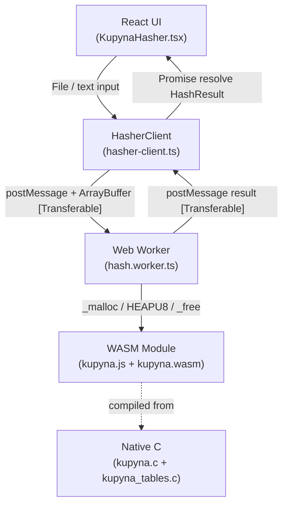
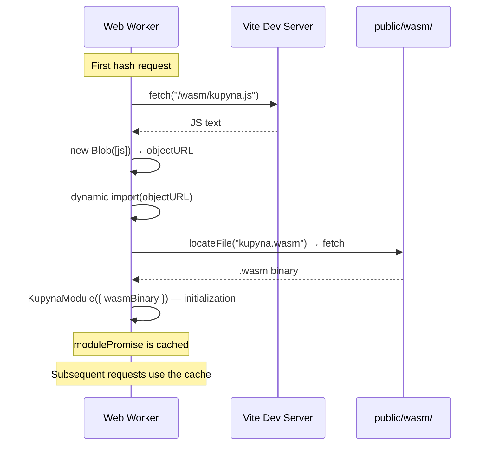
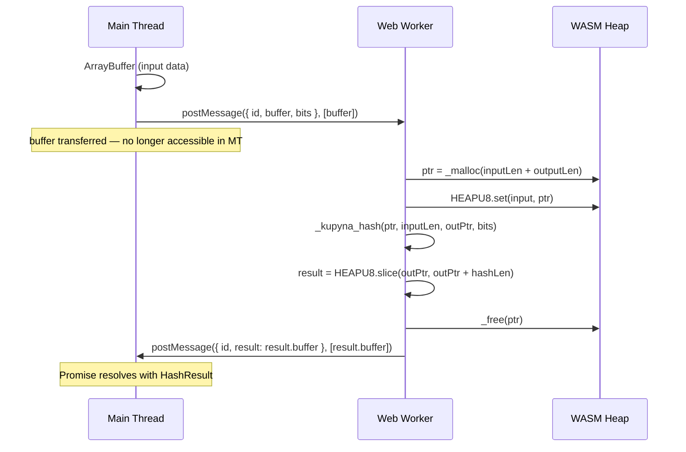

# Kupyna (DSTU 7564:2014) — WebAssembly Implementation

> [Українська версія](README.UK.md)

[](https://github.com/justpetrovych/dstu7564-ts-worker/actions/workflows/deploy.yml)
[](LICENSE)

> **Note:** This is an educational/research project for exploring WebAssembly integration with Web Workers in the browser. **Not intended for production use.** For real cryptographic needs, use verified libraries and native browser APIs (SubtleCrypto).

Implementation of the Ukrainian cryptographic standard **Kupyna (DSTU 7564:2014)** in WebAssembly with SIMD optimizations, a Web Worker, and a React 19 demo page.

**[→ Live demo on GitHub Pages](https://justpetrovych.github.io/dstu7564-ts-worker/)**

## Project Goals

This repository is a practical exploration of **how to correctly integrate WASM into a Web Worker**:

- How to load an Emscripten module inside a Worker, bypassing the bundler (Vite)
- How to pass data between the Main Thread and Worker using **Transferable Objects** (zero-copy)
- How to cache the WASM module between requests within the same Worker process
- How to build a Promise-based API on top of `postMessage` communication
- How to properly configure COOP/COEP headers for `SharedArrayBuffer`

## Features

- **WebAssembly SIMD** — C implementation compiled via Emscripten with `-O3 -msimd128`
- **Web Worker** — computation runs in a separate thread, UI stays responsive
- **Transferable Objects** — zero-copy `ArrayBuffer` transfer between threads
- **Full DSTU 7564:2014 compliance** — verified cryptographic constants
- **Vitest tests** — unit tests for utilities + cryptographic correctness against reference values

## Supported Hash Sizes

| Algorithm   | Output     | Block     | Rounds |
|-------------|------------|-----------|--------|
| Kupyna-256  | 32 bytes   | 512 bits  | 10     |
| Kupyna-384  | 48 bytes   | 1024 bits | 14     |
| Kupyna-512  | 64 bytes   | 1024 bits | 14     |

## Architecture

### Thread Flow



### WASM Loading in the Worker



### Data Transfer Between Threads



## Key Architectural Decisions

### Why Blob URL for WASM Loading

Vite transforms all `import()` calls at build time. Emscripten generates its own `import()` to load the `.wasm` file, so a direct `import('kupyna.js')` breaks after bundling. The solution — load the JS as text via `fetch`, wrap it in a Blob URL, and pass that to `import()`. This way Vite never touches the Emscripten-generated module.

### Why Transferable Instead of Copy

For large files (tens of MB), copying an `ArrayBuffer` between threads carries a significant time and memory cost. `Transferable` transfers **ownership** of the buffer without copying — an O(1) operation regardless of size.

### Why a Single Worker Instead of a Worker Pool

For the demo scenario (one file at a time), a single Worker is sufficient. The WASM module is initialized once and cached. For parallel processing of multiple files, consider a `WorkerPool` or `SharedArrayBuffer` + `Atomics`.

## Project Structure

```
dstu7564-ts-worker/
├── native/
│   ├── src/kupyna.c            # DSTU 7564:2014 algorithm
│   ├── src/kupyna_tables.c     # 16 KB substitution table
│   ├── include/kupyna.h        # Public C API
│   └── CMakeLists.txt          # Emscripten configuration
├── scripts/build-wasm.sh       # cmake + emmake → public/wasm/
├── src/
│   ├── components/
│   │   ├── KupynaHasher.tsx    # Main UI component
│   │   └── ui/                 # Button, Card, Progress, Badge
│   ├── worker/hash.worker.ts   # Web Worker + WASM loading
│   ├── lib/hasher-client.ts    # Promise API for Worker
│   ├── lib/hash-utils.ts       # toHex, formatBytes
│   └── __tests__/              # Vitest tests
└── .github/workflows/deploy.yml
```

## Local Development

### Prerequisites

- Node.js ≥ 20
- pnpm ≥ 9
- [Emscripten SDK](https://emscripten.org/docs/getting_started/downloads.html) (for WASM compilation)

### Getting Started

```bash
# Clone
git clone https://github.com/justpetrovych/dstu7564-ts-worker.git
cd dstu7564-ts-worker

# Install dependencies
pnpm install

# Compile WASM (requires emcc)
pnpm build:wasm

# Dev server
pnpm dev
```

### Tests

```bash
pnpm test          # Run all tests
pnpm test:watch    # Watch mode
```

Utility tests always run. WASM cryptographic tests run only if `public/wasm/kupyna.js` has been built.

### Build

```bash
pnpm build:wasm    # WASM (Emscripten)
pnpm build         # Vite bundle
pnpm preview       # Preview build
```

## Compiler Optimizations

```bash
-O3 -flto          # Maximum optimization + LTO
-msimd128          # SIMD vector instructions
-sWASM_BIGINT      # Native 64-bit operations (no i64 legalization)
-sMODULARIZE=1     # ES Module with factory function
-sEXPORT_ES6=1     # ES6 export for clean import in Worker
```

## Cryptographic Verification

Algorithm constants (S-Boxes, IV, round constants) are verified against:
1. **Official standard**: DSTU 7564:2014
2. **Reference implementation**: [privat-it/cryptonite](https://github.com/privat-it/cryptonite)

Reference values for tests were obtained via native GCC compilation:

| Input               | Size    | Hash (first 16 bytes)    |
|---------------------|---------|--------------------------|
| `""` (empty)        | 256-bit | `cd5101d1ccdf0d1d...`    |
| `"Hello, World!"`   | 256-bit | `3adab8ab5c58f965...`    |
| `"Hello, World!"`   | 384-bit | `547b06174c72476d...`    |
| `"Hello, World!"`   | 512-bit | `de3614f39b0dbe8a...`    |

## Additional Resources

- [DSTU 7564:2014 (PDF)](https://usts.kiev.ua/wp-content/uploads/2020/07/dstu-7564-2014.pdf)
- [Kupyna Specification (eprint)](https://eprint.iacr.org/2015/885.pdf)
- [Emscripten Documentation](https://emscripten.org/docs/)
- [Using the Web Workers API — MDN](https://developer.mozilla.org/en-US/docs/Web/API/Web_Workers_API/Using_web_workers)
- [Transferable objects — MDN](https://developer.mozilla.org/en-US/docs/Web/API/Web_Workers_API/Transferable_objects)
